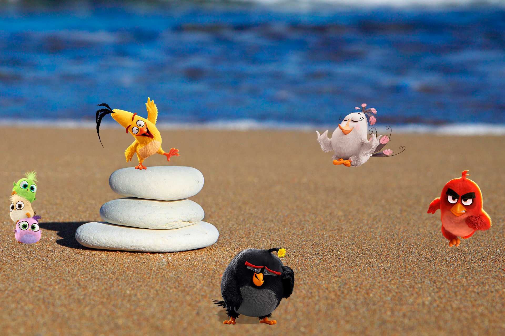

# Ejercicio-Flex

Ejercicio básico de Flexbox:

1- Representa la escena acomodando a los personajes en la playa. Recuerda pensar en los contenedores de estos elementos como cajas para poder mover los ítems.
2- Además, ten en cuenta que la imagen de fondo es justamente eso: un background-image.
3- Debe estar posicionado con Flexbox (excluyente).

  
<!DOCTYPE html>
<html lang="es">
<head>
    <meta charset="UTF-8">
    <meta name="viewport" content="width=device-width, initial-scale=1.0">
    <title>Imagen con varias imágenes dentro</title>
    <link rel="stylesheet" href="styles.css">
</head>
<body>
    

        

            
            

                 
                 
                
                
                
            

        

    

</body>
</html>
